# Article Scanner

An application that allows you to scan articles, save and keep track of them, separated in lists, where you can edit them and more!

Built in with react native and expo

It fetches the articles from this API that I made [here](https://github.com/enriquedlc/article-scanner-server)

### GALERY✨

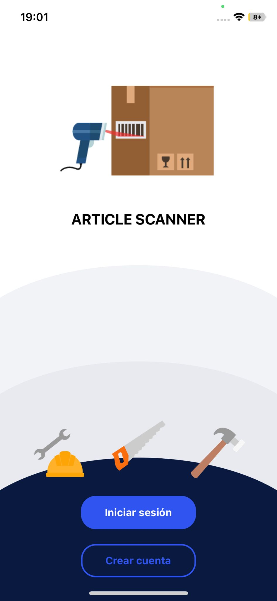

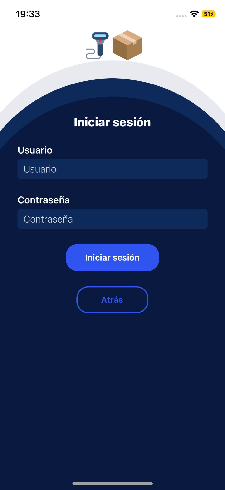

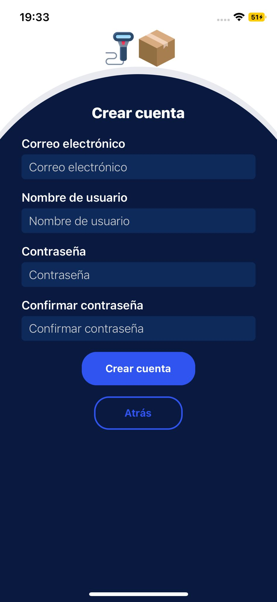

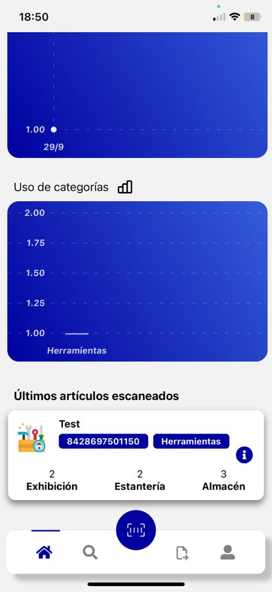
  
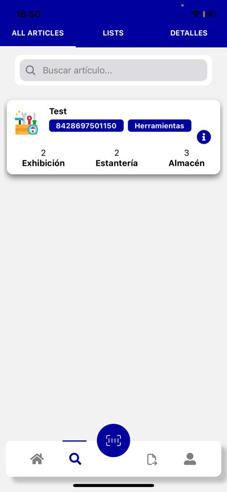

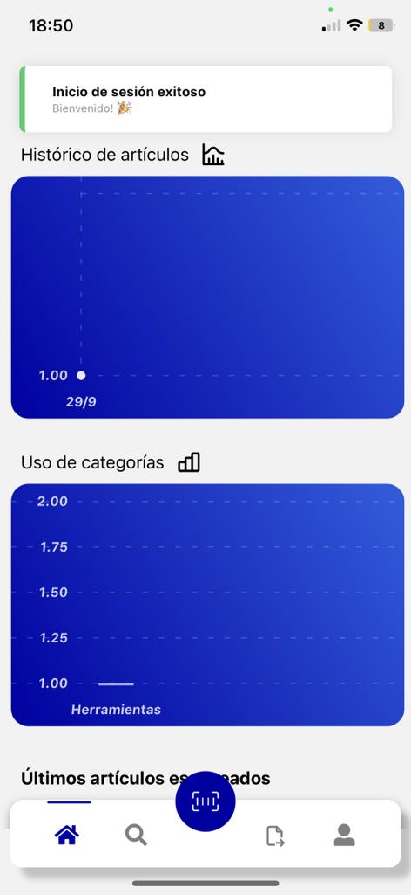

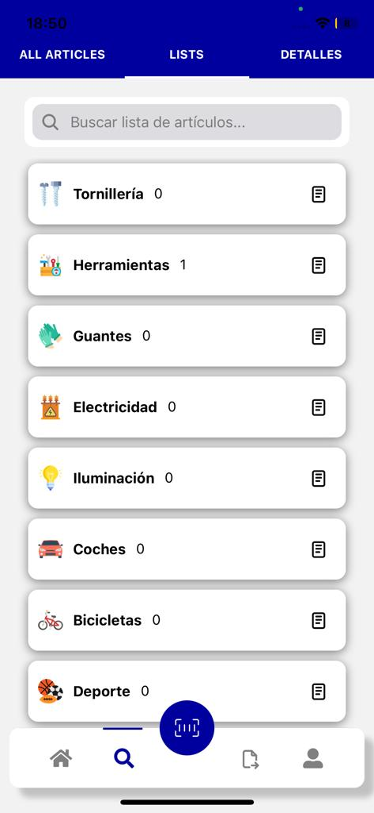

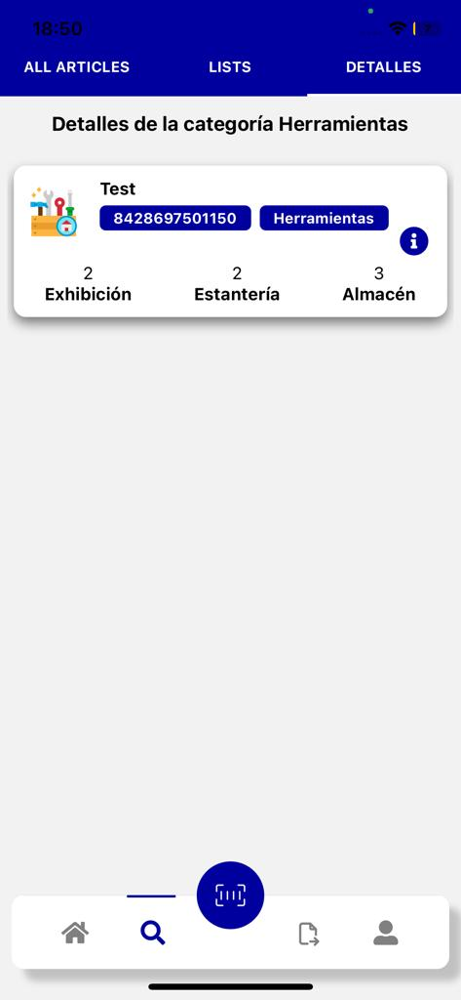

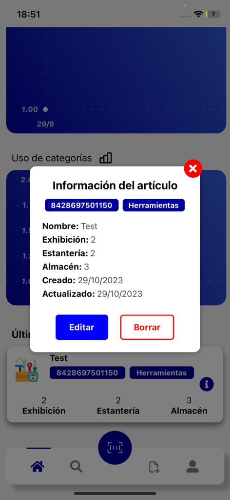

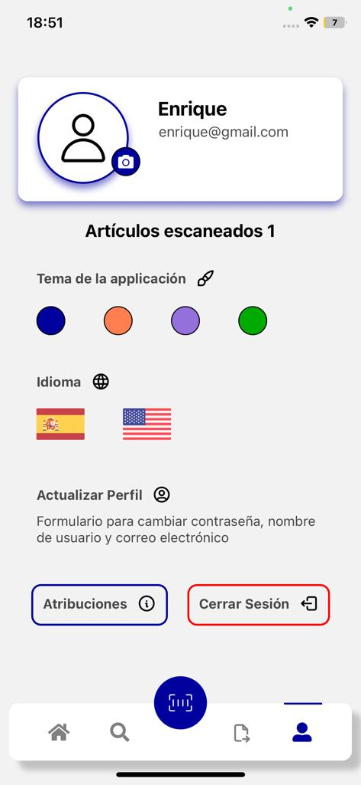

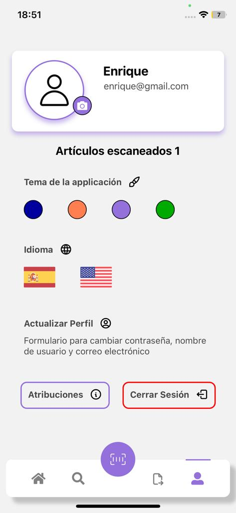

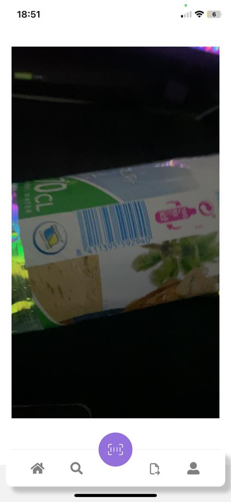

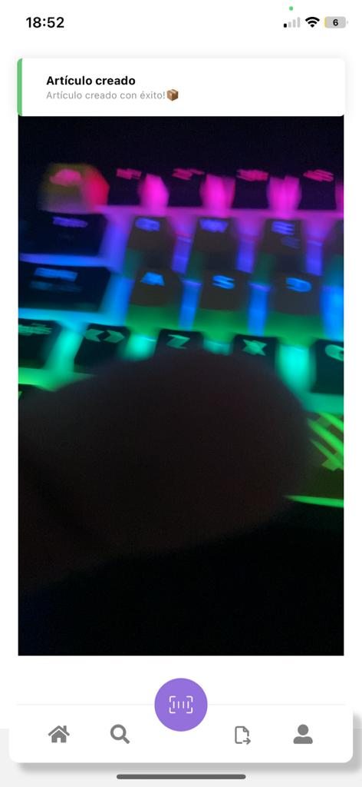

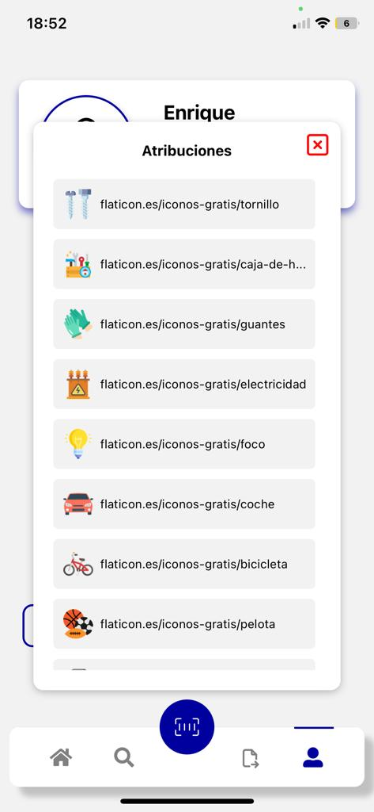

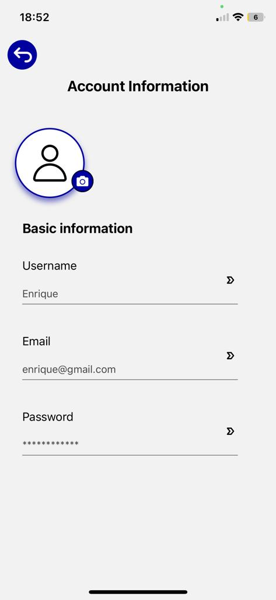

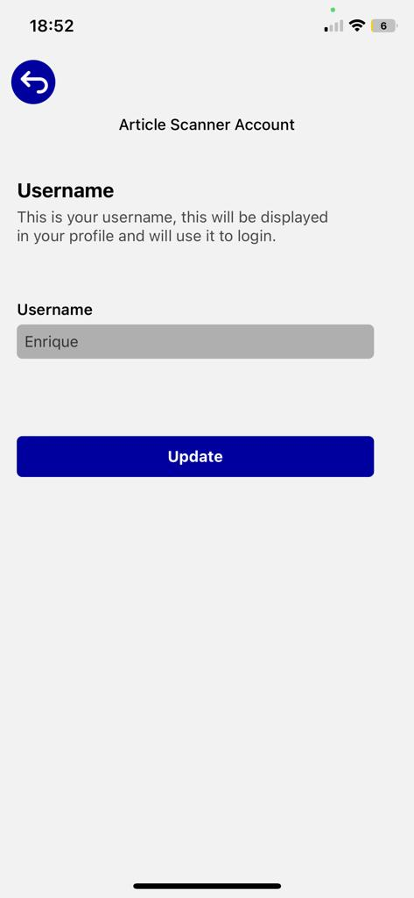

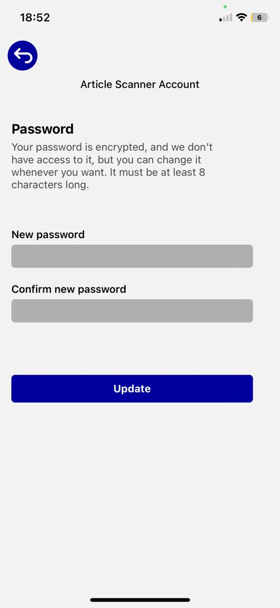

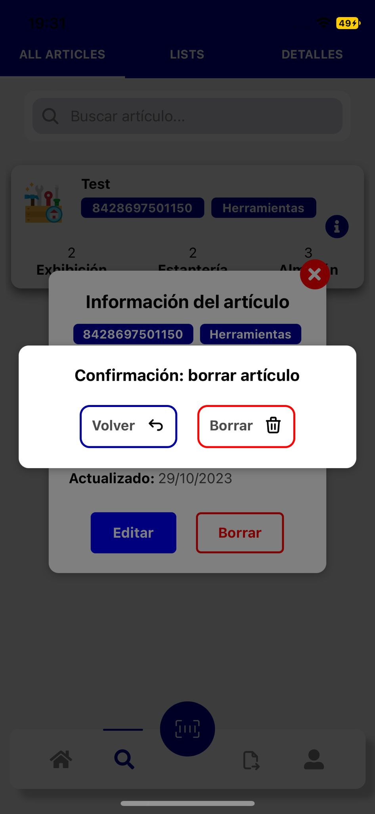

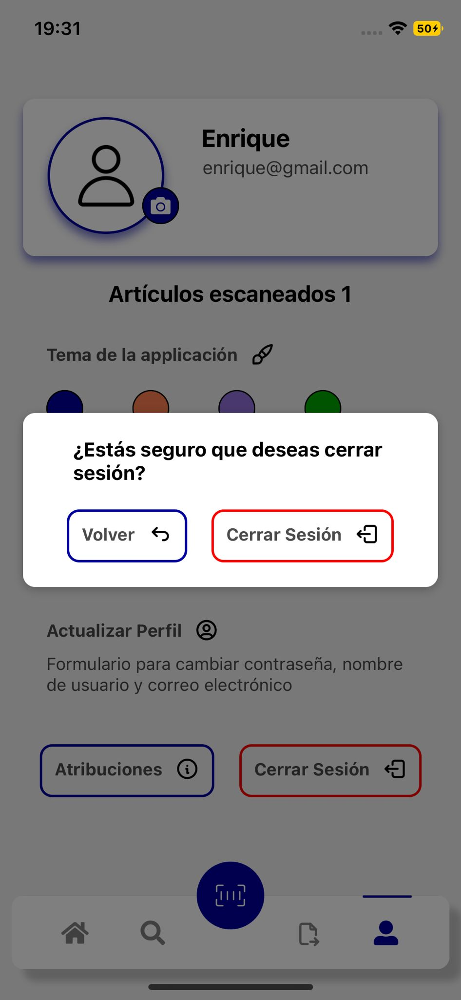

